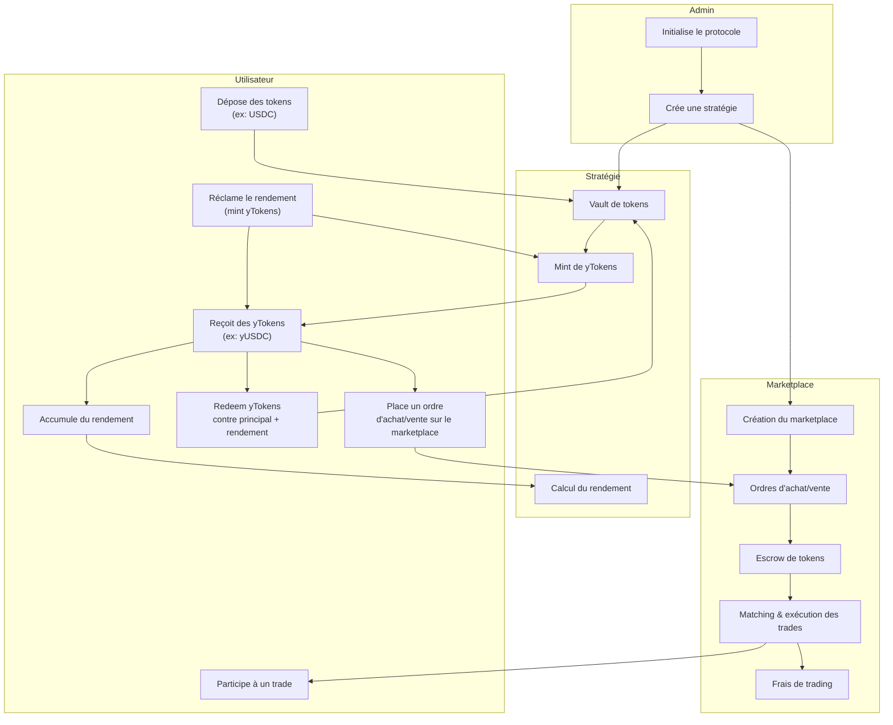

# Yieldos - Smart Contract

Yieldos est un protocole DeFi sur Solana permettant :
- la création de stratégies de rendement (staking, lending, etc.),
- le dépôt de tokens pour générer du rendement,
- la réception de tokens de rendement (yTokens),
- l’échange de ces yTokens sur un marketplace décentralisé.

## Fonctionnalités principales

1. **Initialisation du protocole**  
   Un administrateur initialise le protocole.

2. **Création de stratégie**  
   L’admin crée une stratégie (ex : yUSDC, ySOL) avec un APY défini.

3. **Dépôt dans une stratégie**  
   Un utilisateur dépose des tokens (ex : USDC) dans une stratégie et reçoit des yTokens (ex : yUSDC).

4. **Accumulation et réclamation du rendement**  
   Les utilisateurs accumulent du rendement (mint de nouveaux yTokens) qu’ils peuvent réclamer.

5. **Rachat (redeem) des yTokens**  
   Les utilisateurs peuvent échanger leurs yTokens contre le principal + rendement accumulé.

6. **Marketplace décentralisé**  
   - Création d’un marketplace pour chaque stratégie.
   - Les utilisateurs peuvent placer des ordres d’achat/vente de yTokens.
   - Les trades sont exécutés via matching d’ordres, avec gestion d’escrow et de frais.

---

## Schéma du protocole (Mermaid)

---

## Description des comptes principaux

- **Strategy** : stocke l’admin, le token sous-jacent, le mint de yToken, l’APY, les dépôts, etc.
- **UserPosition** : position individuelle d’un utilisateur dans une stratégie (montant déposé, yTokens mintés, etc.).
- **Marketplace** : gère les ordres, le volume, les frais, le statut actif.
- **TradeOrder** : représente un ordre d’achat/vente sur le marketplace.

---

## Instructions principales

- `initialize_protocol` : initialise le protocole.
- `create_strategy` : crée une nouvelle stratégie de rendement.
- `deposit_to_strategy` : dépose des tokens et reçoit des yTokens.
- `claim_yield` : réclame le rendement accumulé (mint de yTokens).
- `redeem_yield_tokens` : échange des yTokens contre le principal + rendement.
- `create_marketplace` : crée un marketplace pour une stratégie.
- `place_order` : place un ordre d’achat/vente de yTokens.
- `execute_trade` : exécute un trade entre deux ordres.
- `cancel_order` : annule un ordre et rembourse l’utilisateur.

---

## Exemple de flux utilisateur

1. Alice dépose 1000 USDC dans la stratégie yUSDC.
2. Elle reçoit 1000 yUSDC.
3. Après un certain temps, elle réclame son rendement : elle reçoit des yUSDC supplémentaires.
4. Elle peut :
   - Redeem ses yUSDC contre USDC + rendement,
   - Ou vendre ses yUSDC sur le marketplace à Bob.

---

## Pour aller plus loin

- Voir le dossier `programs/contracts/src/` pour le code source complet.
- Les tests sont dans `tests/`.
- Scripts d’exemple dans `scripts/`.
